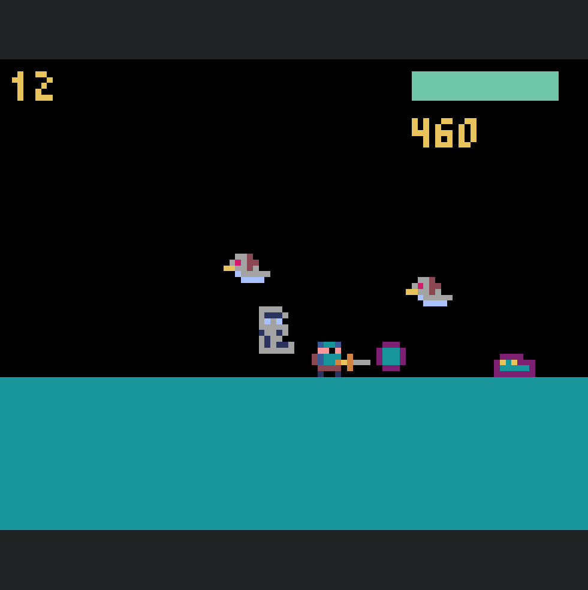

# Python game school project
This is a school project heavily inspired by Slayin',
written in python with the pyxel fantasy console.
Made by [Brugir](https://github.com/Brugir) and I.



## Dependencies
To play the project, you need to have the following dependencies installed in your system:
- Python3
- [Pyxel](https://github.com/kitao/pyxel)
- [Sqlite](https://sqlite.org/)

To execute, run:

```bash
python3 main.py
