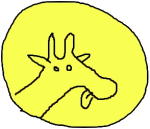
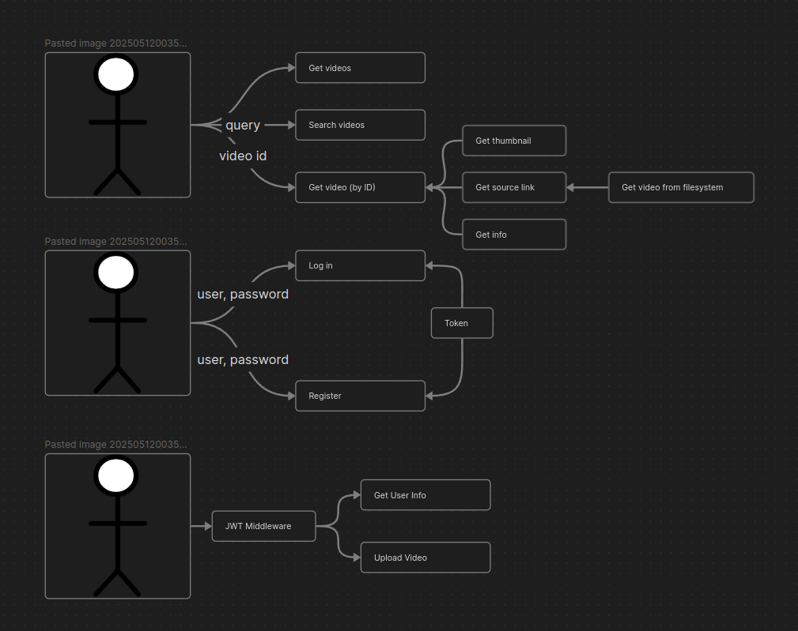

# Jirafeitor Video service - final project

[](https://golang.org/)



This project is a video service from where users can upload and play videos.

This project was developed as part of the Web Development course at ETP Xavier.

## Features

* **Cool videos!!:** El berni hace piruetas
* **Thumbnails and info:** It is indeed a very complete API.
* **Sessions and authentication:** So that we don't get anons posting \<insert illegal video title here\>
* **Upload and search for videos:** To interact with the api (it's interactive!!)

**Limitations:**
* This thing doesn't allow deleting or editing anything, and it could never be used in production in its current state.
* It also allows files other than videos. Again, because of the lack of time.

## Technologies Used

* **Go:** The primary programming language.
* **Gin Gonic** Super minimal and fast Go framework for basic functionality
* **Postgresql** It was meant for more advanced features, but the only remarkable utility of it is to fuzzy search. Aside from that, it's just a basic relational database.
* **W3 Technologies** The website works with basic html/css/js for a lightweight and fast experience.

Frontend deployed at [](https://brugir.github.io/M12-UF3-PF/)

Api deployed at [giraffe.niliara.net](https://giraffe.niliara.net)

Documentation: [giraffe.niliara.net/api/docs/index.html](https://giraffe.niliara.net/api/docs/index.html)

## UML diagram
The documentation already provides a lot of information,
but here's one if you still need it:



## Architecture
This project uses a common ideomatic Gin Gonic architecture.
There is not much reason put into it, it's just by convention.

If I needed to give it a name,
it would probably be a layered architecture
because of the way it separates things
(and it's certainly not MVC).

```
├── cmd
│   └── docs // swag init
├── config
├── docs // swagger - auto generated
├── handlers
├── middlewares
├── models
│   ├── api
│   ├── errorresponses
│   ├── postgres
│   └── responses
├── repository
├── routes
├── static
└── utils
    ├── auth
    ├── thumbnail
    └── upload
```

The process is simple:
the requests are recieved in routes/
and handled in handlers/.
If they need to interact with the database,
they will do so from the repository/ layer.

Json responses and custom errors are
saved in /models/responses and /models/errorresponses,
respectively.


## Details of the code
### Backend
It is worth mentioning that the program generates
thumbnails using an ffmpeg command.
The program also redirects video links into nginx-handled links,
that way it won't run out of cache.

Aside from that, there isn't much to tell.
Golang is a language meant to be dead simple,
It's not like Javascript, which can do anything and nothing good at the same time.
Go has a simple way of handling things and that's about it.

And especially since the backend uses Gin Gonic,
there is simply nothing to be said about this code.
Nothing unique or remarkable.
As far as I'm aware, this is the standard way to implement
Gin with JWT and Pgx.


## Dependencies
Postgres, Go, Rust (for the frontend) and ffmpeg.
All the libraries they depend on are in the go.mod and Cargo.toml files.

## Endpoints
Listed in [swagger](https://giraffe.niliara.net/api/docs/index.html)

## Honorable mentions
There was an attempt to make a cross-platform GUI
(located at gtk-front/).
However, Rust's way to handle async and borrowing
made it extremely hard and we had to give it up.
